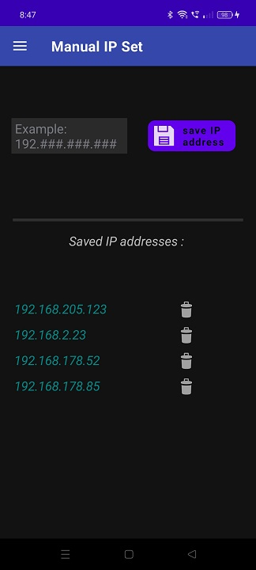

# ESP32cam_Find_IP_and_Stream

## An Android App For Auto-detecting and Streaming of ESP32 cameras.

### This Android app allows easy management and streaming of multiple ESP32 cameras connected to the local network.
### How to use the app :

* To navigate throught the different screens of the app, click on the top left icon. 
* To view an ESP32 camera's video stream, you first have to add it's IP address. 

  
&nbsp; &nbsp; &nbsp; &nbsp;
  

* If the camera's IP is known, you can enter it manually in the Manual IP Set screen of the app.  
* When the IP of a camera is not known, you can scan the local network for connected ESP32 cameras in the Auto IP detect screen of the app. 
All detected or manually entered camera IP's will be saved to the list of camera IP addresses. 
You can remove any IP from the list at any time, by touching the delete icon . 

  
&nbsp; &nbsp; &nbsp; &nbsp;
  

* In the Stream Display screen of the app, the video feeds of the added cameras are displayed. If a camera is currently disconnected, a camera not availabe image will be displayed . 
You can refresh all the video feeds by pressing the refresh icon on the top right corner. 
You can pinch-zoom or recenter any video feed. Also, you can rotate the video of any camera, by pressing the rotation icon. The layout of the video feeds is dynamically changing, according to their number.  

  
&nbsp; &nbsp; &nbsp; &nbsp;
  

* By pressing the Fullscreen icon, you can view a specific video feed in fullscreen. Pinch-zooming and recentering is supported. For greater control over the image, you can also use the zoom slider.   

  

  
&nbsp; &nbsp; &nbsp; &nbsp;
  

* By pressing the Settings icon, you can scroll throught and change the settings of a specific camera. You can check the effect of the changes in the video feed displayed on the upper part of the screen.

  

